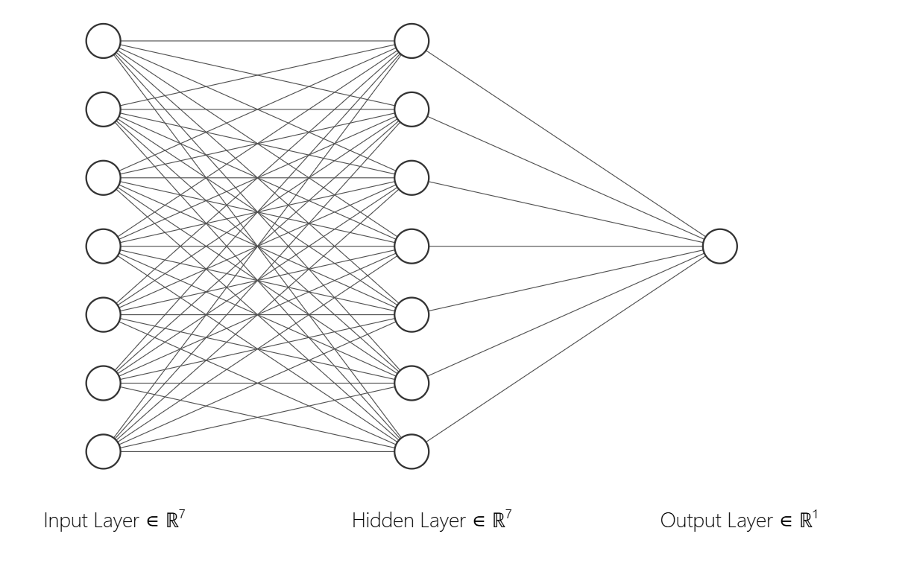
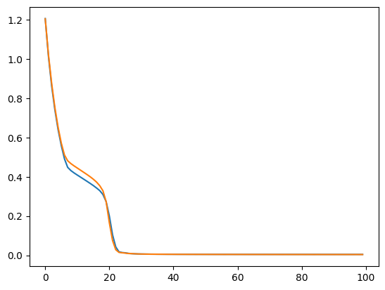

# Graduate Admission Prediction

## Overview

This project focuses on predicting a student’s likelihood of admission to a graduate program using an Artificial Neural Network regression model. The model estimates the chances of admission based on academic and profile-related parameters such as GRE Score, TOEFL Score, University Rating, Statement of Purpose (SOP) strength, Letter of Recommendation (LOR) strength, CGPA, and Research experience.

The goal is to provide an end-to-end regression pipeline that demonstrates how neural networks can be applied to continuous target prediction problems in the education domain.

## Objective

- Analyze factors influencing graduate admission chances.
- Build a regression-based ANN model using TensorFlow/Keras.
- Evaluate model performance using regression metrics (R2-score).
- Visualize model predictions against actual outcomes.

## Directory Structure

```md
Graduate-Admission-ANN/
|
├── data/
|   └── Admission_Predict_Ver1.1.csv
|
├── images/
|   ├── loss.png
|   └── NN-architecture.png
|
├── .gitignore
├── pipeline.ipynb
├── README.md
└── requirements.txt


```

## Dataset

Link to Dataset - [Kaggle](https://www.kaggle.com/datasets/mohansacharya/graduate-admissions) or [GitHub](https://github.com/Saumyajeet-Varma/Graduate-Admission-Prediction-ANN/blob/main/data/Admission_Predict_Ver1.1.csv)

Features typically include: 
- GRE Score
- TOEFL Score
- University Rating
- SOP
- LOR
- CGPA
- Research

## Workflow

1. Data Loading
    - Import the dataset into the notebook.
2. Feature Selection
    - Select relevant features such as GRE Score, TOEFL Score, University Rating, SOP, LOR, CGPA, and Research.
    - Define the target variable as Chance of Admit.
3. Data Splitting and Scaling
    - Split the dataset into training and test sets to evaluate model performance.
    - Apply feature scaling (MinMax Normalization) to normalize the feature values for better ANN convergence.
4. Model Architecture:
    - **Input layer**: 7 neurons
    - **Hidden layer**: 7 neurons with relu activation functions.
    - **Output layer**: 1 neuron linear activation for regression.
5. Model Compilation:
    - **Optimizer**: Adam
    - **Loss Function**: MSE
6. Training:
    - Train the model on the training dataset for a fixed number of epochs.
7. Evaluation:
    - Evaluate performance on the test set using metrics like R2-score.
    - Test loss on the validation dataset.
8. Visualization:
    - Display loss curves.

## Model Architecture

- Input layer: 7 neurons
- Hidden layer: 7 neurons with relu activation functions.
- Output layer: 1 neuron linear activation for regression.



## Result

R2-score: 0.7689996936586804

<table>
    <tr>
        <th>Loss Curve</th>
    </tr>
    <tr>
        <td></td>
    </tr>
</table>

## Contributor

<a href="https://github.com/Saumyajeet-Varma"></a>